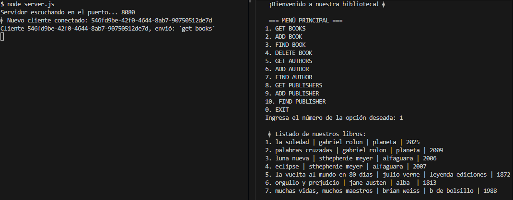
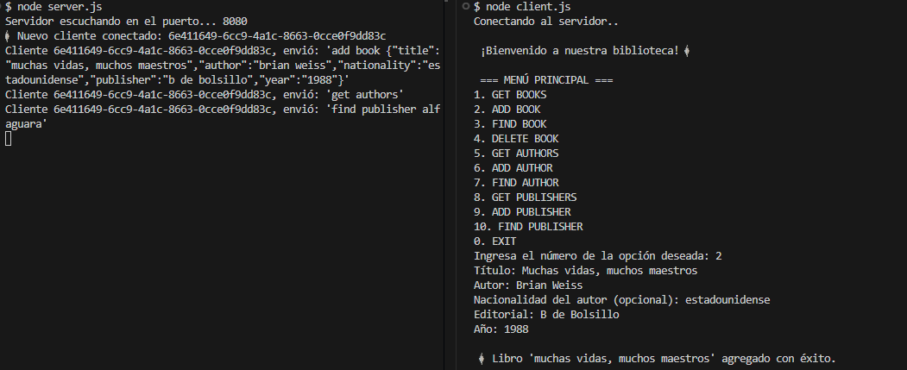
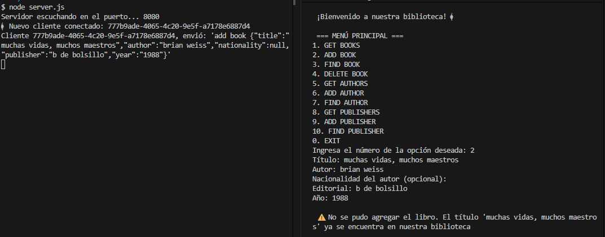
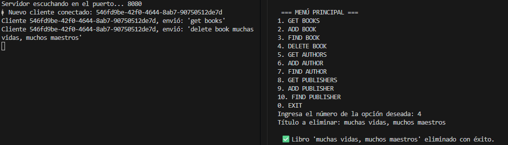
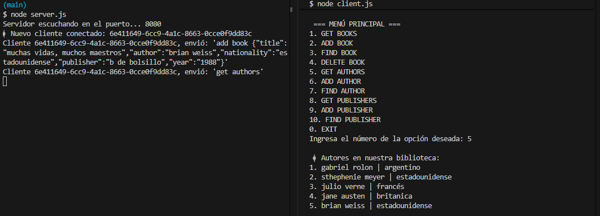
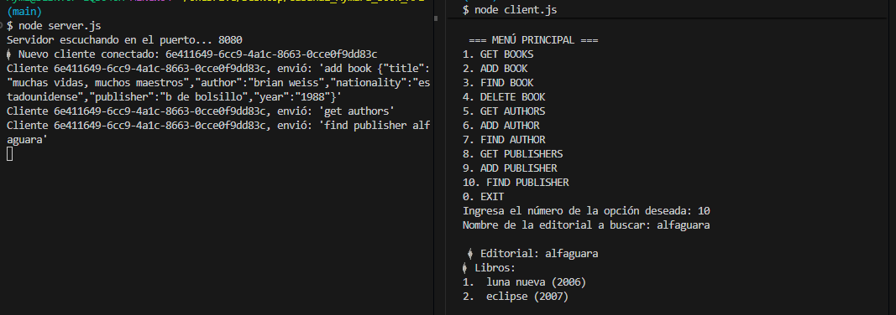
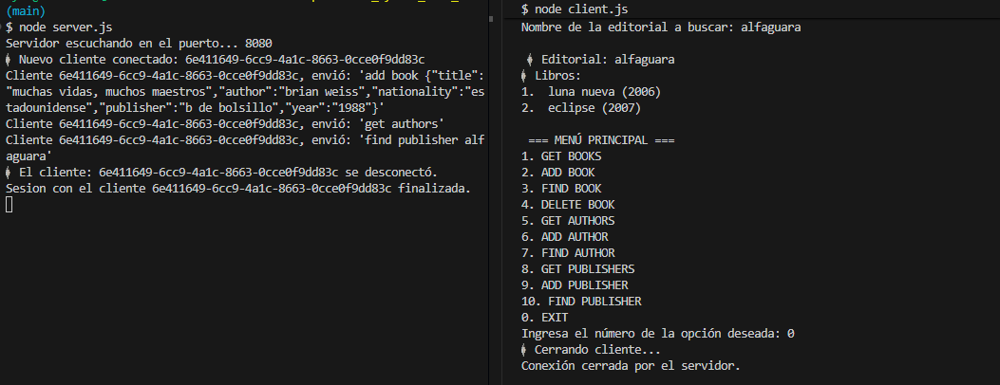

# 🚀 PROYECTO INTEGRADOR FINAL 
## 📚 Gestión de Biblioteca TCP 

## Índice
- [Descripción](#descripción)   
- [Requisitos](#requisitos)  
- [Instalación](#instalación)  
- [Estructura del proyecto](#estructura-del-proyecto)  
- [Ejecutar el proyecto](#ejecutar-el-proyecto)  
- [Comandos disponibles](#comandos-disponibles)  
- [Ejemplos de uso](#ejemplos-de-uso)  
- [Notas finales](#notas-finales)  

---

## Descripción

Este proyecto implementa una **API de biblioteca** utilizando un **servidor TCP en Node.js**.  
Permite administrar **libros, autores y editoriales** mediante comandos enviados desde un cliente CLI (Command Line Interface).  

El servidor se encarga de:  
- Recibir los comandos del cliente.  
- Procesarlos usando controladores y modelos.  
- Enviar respuestas formateadas usando la vista (`LibraryView`).  

---

## Requisitos

- Node.js ≥ 18  
- npm  
- Sistema operativo con terminal/CLI  
- Instalar la biblioteca UUID para generar identificadores únicos.

---

## Instalación

1. Clonar el repositorio:  
git clone <URL_DEL_REPOSITORIO>

2. Instalar dependencias:
Solo se necesita la librería uuid. Node.js ya provee el resto de las funcionalidades.
```bash 
npm install uuid
```
3. Asegurarse de tener los archivos JSON en la carpeta ./data/

* books.json

* authors.json

* publishers.json

---

## Estructura del proyecto
```
├─ client.js                  # Cliente TCP con menú interactivo
├─ server.js                  # Servidor TCP que procesa comandos
├─ controllers/               # Lógica de negocio
│   ├─ booksController.js
│   ├─ authorsController.js
│   └─ publishersController.js
├─ models/                    # Acceso y manejo de datos JSON
│   ├─ booksModel.js
│   ├─ authorsModel.js
│   └─ publishersModel.js
├─ views/                     # Formato de salida para el cliente
│   └─ viewResponse.js
├─ data/                    # Archivos JSON que almacenan la info
│   ├─ books.json
│   ├─ authors.json
│   └─ publishers.json
└─ README.md                # Documentación del proyecto
```

--- 

## Ejecutar el proyecto

1. Iniciar el servidor:

```
node server.js
```

2. Iniciar el cliente:

```
node client.js
```

---

## Comandos disponibles

### 📚 Libros:

| Comando         | Ejemplo                | Respuesta esperada |
|-----------------|-----------------------|------------------|
| Listar libros   | `get books`           | 📚 Listado de nuestros libros:<br>1. Título |
| Agregar libro   | `add book {JSON}`     | 📖 Libro 'Título' agregado con éxito.<br>⚠️ Si ya existe: No se puede agregar. |
| Buscar libro    | `find book Título`    | 📚 Título: ... |
| Eliminar libro  | `delete book Título`  | ✅ Libro 'Título' eliminado con éxito.<br>🚫 Si no existe: Mensaje de error |

JSON para agregar libro:

```
{
  "title": "Cien años de soledad",
  "author": "Gabriel García Márquez",
  "publisher": "Sudamericana",
  "year": "1967",
  "nationality": "Colombiana"
}
```


### ✒️ Autores 

| Comando         | Ejemplo                  | Respuesta esperada |
|-----------------|-------------------------|------------------|
| Listar autores  | `get authors`           | 📚 Listado de autores:<br>1. Nombre - Nacionalidad |
| Agregar autor   | `add author {JSON}`     | ✅ Autor 'Nombre' agregado con éxito.<br>⚠️ Si ya existe: No se puede agregar. |
| Buscar autor    | `find author {JSON}`    | 📚 Nombre: ... - Nacionalidad: ...<br>🚫 Si no existe: Mensaje de error |

JSON para agregar autor:
```
{
  "name": "Gabriel García Márquez",
  "nationality": "Colombiana"
}
```

### 🏢 Editoriales

| Comando           | Ejemplo                | Respuesta esperada |
|------------------|-----------------------|------------------|
| Listar editoriales | `get publishers`     | 🏢 Editoriales en nuestra biblioteca:<br>1. Nombre |
| Agregar editorial  | `add publisher Nombre` | ✅ Editorial 'Nombre' agregada con éxito.<br>⚠️ Si ya existe: No se puede agregar. |
| Buscar editorial   | `find publisher Nombre` | 📚 Editorial: Nombre<br>📚 Libros:<br>1. Título (Año)<br>🚫 Si no tiene libros o no existe: Mensaje de error |

JSON para agregar editorial:
```
{
  "name": "Planeta"
}
```

### Ejemplos de uso:

A continuación se muestran capturas de pantalla de la interacción con el servidor TCP, tanto del **cliente** como del **servidor**.

### 📚 Listar libros

- Comando enviado: `get books`
- Respuesta esperada: `📚 Listado de nuestros libros: `




### Agregar un libro
- Comando enviado: `add book {JSON}`
- Respuesta esperada: `📖 Libro 'Título' agregado con éxito.`



### Agregar un libro que ya existe

- Comando enviado: `add book {JSON}`
- Respuesta esperada: `⚠️ No se puede agregar. El libro "Título" ya existe.`




### Borrar libro

- Comando enviado: `delete book `
- Respuesta esperada: `✅ Libro 'Título' eliminado con éxito.`



### Listar autores

- Comando enviado: `get authors`
- Respuesta esperada: Listado de todos los autores registrados en la biblioteca.




### Buscar editorial

- Comando enviado: `find publisher NombreEditorial`
- Respuesta esperada: Muestra el nombre de la editorial y los libros que tiene registrados.




### Cerrar cliente

- Comando enviado: `0` (Exit)
- Respuesta esperada: El cliente se desconecta y el servidor muestra que el cliente finalizó la sesión.




## 📝 Notas finales

- Este proyecto consiste en un servidor TCP para manejar libros, autores y editoriales.
- Todos los títulos, nombres de autores y editoriales se normalizan para evitar duplicados.
- Los datos se almacenan en archivos JSON locales, por lo que la persistencia depende de estos archivos.
- Para agregar nuevos libros, autores o editoriales, asegurarse de no duplicar entradas existentes.
- Se recomienda cerrar la conexión correctamente usando la opción `0. Exit` en el cliente.


## 👤 Autor

**Aymara Cabanal**  
GitHub: [@AymaraC](https://github.com/AymaraC)  
Email: [aymicabanal@hotmail.com](mailto:aymicabanal@hotmail.com)


